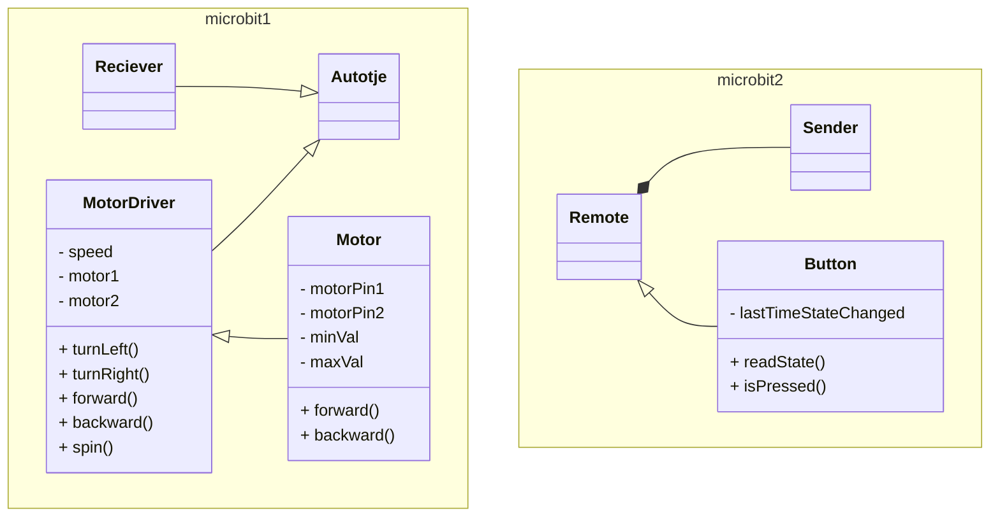

```mermaid
classDiagram
    namespace microbit1 {
        class Autotje {
            
        }

        class Motor {
            - motorPin1
            - motorPin2
            - minVal
            - maxVal
            + forward()
            + backward()
        }
        
        class MotorDriver {
            - speed
            - motor1
            - motor2
            + turnLeft()
            + turnRight()
            + forward()
            + backward()
            + spin()
        }

        class Reciever {

        }
    }

    namespace microbit2 {
        class Remote {
        }
    
        class Sender {
        }
    
        class Button {
            - lastTimeStateChanged
            + readState()
            + isPressed()
            
        }
    }

    MotorDriver --|> Autotje
    Reciever --|> Autotje
    Remote *-- Sender
    Remote <|-- Button
    MotorDriver <|-- Motor
```
