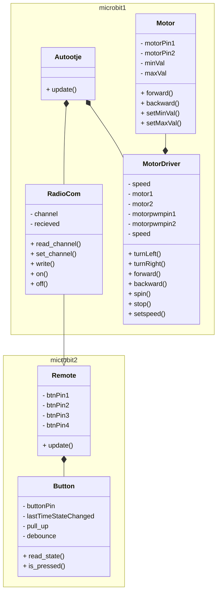

```mermaid
classDiagram
    namespace microbit1 {
        class Autootje {
            
            + update()
            
        }

        class Motor {
            - motorPin1
            - motorPin2
            - minVal
            - maxVal
            + forward()
            + backward()
            + setMinVal()
            + setMaxVal()
        }
        
        class MotorDriver {
            - speed
            - motor1
            - motor2
            - motorpwmpin1
            - motorpwmpin2
            - speed
            + turnLeft()
            + turnRight()
            + forward()
            + backward()
            + spin()
            + stop()
            + setspeed()
        }

        class RadioCom {
            - channel
            - recieved
            + read_channel()
            + set_channel()
            + write()
            + on()
            + off()
        }
    }

    namespace microbit2 {
        class Remote {
            - btnPin1
            - btnPin2
            - btnPin3
            - btnPin4
            + update()
        }
    
        class Button {
            - buttonPin
            - lastTimeStateChanged
            - pull_up
            - debounce
            + read_state()
            + is_pressed()
            
        }
    }

    Autootje *-- RadioCom
    Autootje *-- MotorDriver
    RadioCom --|> Remote
    Remote *-- Button
    Motor --* MotorDriver

```
