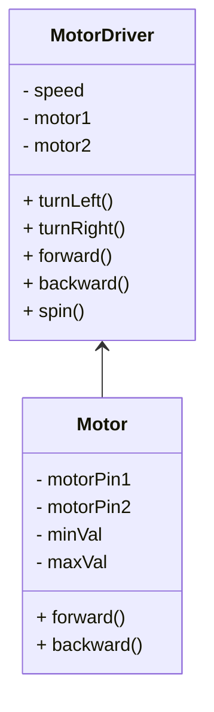

```mermaid
classDiagram
    class Motor {
        - motorPin1
        - motorPin2
        - minVal
        - maxVal
        + forward()
        + backward()
    }
    
    class MotorDriver {
        - speed
        - motor1
        - motor2
        + turnLeft()
        + turnRight()
        + forward()
        + backward()
        + spin()
    }
    
    MotorDriver <-- Motor
```
