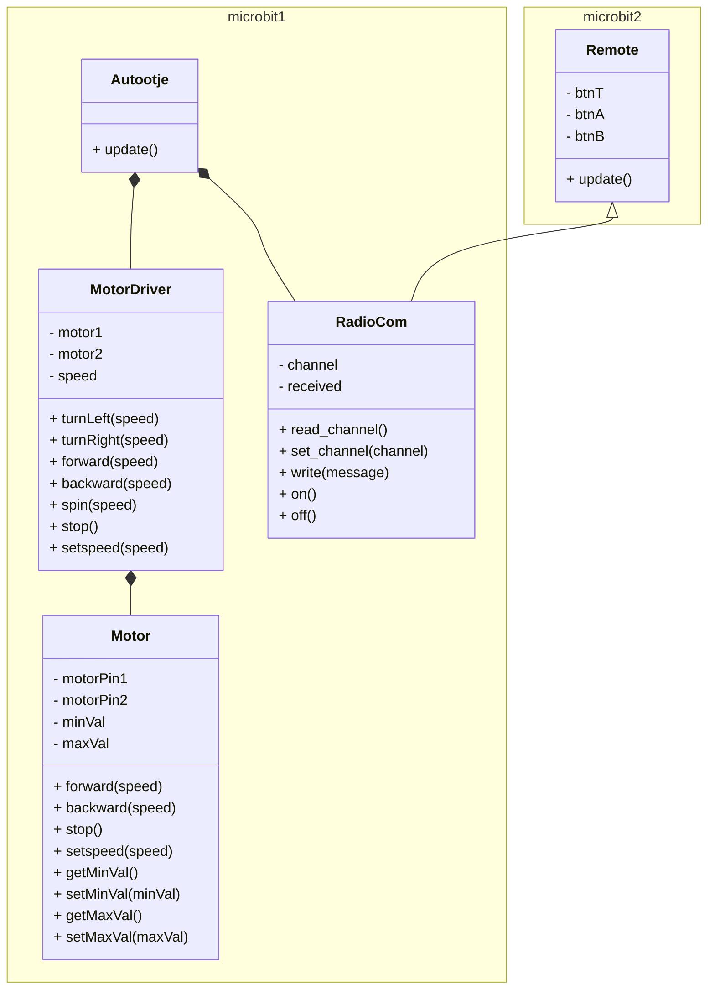

```mermaid
classDiagram
    namespace microbit1 {
        class Autootje {
            + update()
        }

        class Motor {
            - motorPin1
            - motorPin2
            - minVal
            - maxVal
            + forward(speed)
            + backward(speed)
            + stop()
            + setspeed(speed)
            + getMinVal()
            + setMinVal(minVal)
            + getMaxVal()
            + setMaxVal(maxVal)
        }
        
        class MotorDriver {
            - motor1
            - motor2
            - speed
            + turnLeft(speed)
            + turnRight(speed)
            + forward(speed)
            + backward(speed)
            + spin(speed)
            + stop()
            + setspeed(speed)
        }

        class RadioCom {
            - channel
            - received
            + read_channel()
            + set_channel(channel)
            + write(message)
            + on()
            + off()
        }
    }

    namespace microbit2 {
        class Remote {
            - btnT
            - btnA
            - btnB
            + update()
        }
    }

    Autootje *-- RadioCom
    Autootje *-- MotorDriver
    MotorDriver *-- Motor
    Remote <|-- RadioCom


```
